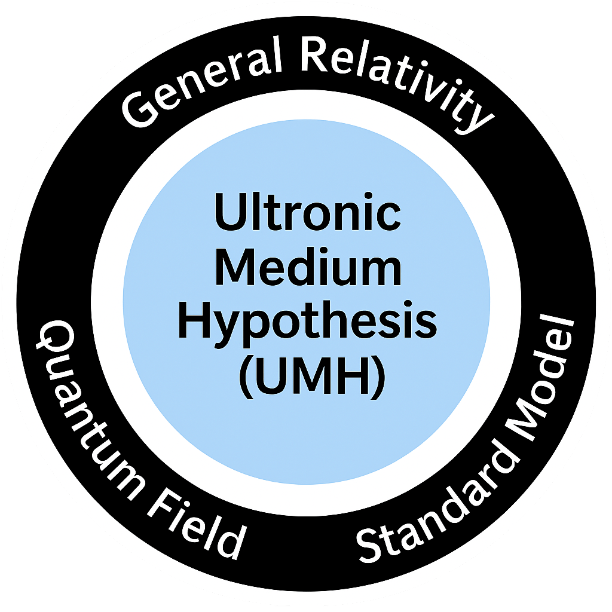

===========================
## Ultronic Medium Hypothesis (UMH)
===========================

The Ultronic Medium Hypothesis (UMH) is a novel theoretical framework proposing that all physical phenomena - matter, fields, forces, and spacetime curvature emerge from oscillations in a continuous mechanical medium. Rather than relying on discrete particles or abstract quantum fields, UMH models the universe as a high-dimensional elastic substrate whose excitations give rise to observable physics. This includes everything from gravitational waves and cosmological expansion to gauge symmetries, quantum entanglement, and thermodynamic behavior.

This repository contains a complete simulation suite for validating UMH through a series of rigorous, numerically intensive tests. The simulations cover a wide range of domains, including general relativity (via gravitational waveforms and Einstein tensor validation), quantum theory (Planck constant emergence and entanglement tests), cosmology (CMB, BAO, redshift models), and gauge field dynamics (U(1), SU(2), SU(3)). All tests are reproducible and designed to generate high-resolution figures, output data, and logs for scientific publication and peer validation.

<p align="center">
  
  <br>
  <em>How General Relativity, Quantum Field Theory, and the Standard Model emerge from the Ultronic Medium Hypothesis (UMH)</em>
</p>

===========================
# Ultronic Medium Hypothesis (UMH) Simulation Suite
===========================

This repository contains the full simulation test suite for validating the **Ultronic Medium Hypothesis (UMH)** — a unified mechanical wave theory of matter, fields, and spacetime.

The included Python framework allows you to execute a wide range of numerical tests, covering wave mechanics, gauge symmetries, cosmological structure, and quantum phenomena.

---

===========================
## 📦 Package Contents
===========================

After extracting the `UMH_SimPkg_Complete` archive, the main contents are:

```
UMH_SimPkg_Complete/
│
├── UMH_Test_Suite.py               # Main launcher for all simulation tests
├── Modules/                        # All source code for test modules
├── Output/                         # Simulation outputs (auto-generated)
└── Logs/                           # Per-test logs (auto-generated)
```

---

===========================
## 🧰 Prerequisites and Setup
===========================

Ensure your system has Python 3.10+ and the required packages. You can install everything in one go with the following setup script:

```bash
# System dependencies
sudo apt update && sudo apt install -y \
  python3 python3-pip python3-venv build-essential libatlas-base-dev \
  ffmpeg libopenmpi-dev openmpi-bin

# Create virtual environment and activate
python3 -m venv umh_env
source umh_env/bin/activate

# Install Python dependencies
pip install numpy numba matplotlib healpy scipy \
            pandas imageio scikit-image h5py \
            mpi4py requests tqdm statsmodels \
            scikit-learn quad partial
```

---

===========================
## 🚀 Running the Simulation Suite
===========================

To run all simulations via a Python-based menu system:

```bash
cd UMH_SimPkg_Complete
source ../umh_env/bin/activate  # activate virtual environment
python UMH_Test_Suite.py
```

This menu-driven interface allows you to select individual tests or run the full suite.

---

===========================
## 🧪 Included Simulation Tests
===========================

The test suite includes **22 physics validation modules**, grouped by research theme:

### Mechanical Foundations

1. **Wave Propagation Speed Constancy**  
2. **Mass-Energy Equivalence**  
3. **Planck Constant Emergence**  
4. **Soliton Scattering and Stability**  

### Cosmological Structure and Expansion

5. **Gravitational Wave Chirp**  
6. **Einstein Tensor Validation**  
7. **Multibody Gravitational Wave Test**  
8. **CMB Angular Power Spectrum**  
9. **CMB Horizon Angular Scale Match**  
10. **BAO and Structure Formation**  
11. **Pantheon Supernova Validation**  
12. **Redshift Without Expansion**  

### Gauge Symmetries and Field Dynamics

13. **Quantum Statistics Emergence**  
14. **Topological Phase-Lock Constraints (U(1), SU(2), SU(3))**  
15. **Gauge Symmetry Dynamics (U(1), SU(2), SU(3))**  
16. **Gauge Coupling Constant Derivation**  
17. **Quantum Entanglement Behavior (CHSH test)**  
18. **Stress-Energy Tensor vs. Einstein Tensor**  
19. **Ricci Scalar Isotropy and Angular Spread**  
20. **Gravitational Wave Energy Flux Decay**  
21. **Renormalization from Strain Thresholding**  
22. **Thermodynamic Consistency and Partition Function**

---

===========================
## 📂 Output and Logging
===========================

- **`Output/`** will be auto-created to store result files (CSV, PNG, GIF, NPY, FITS).
- **`Logs/`** contains logs for each simulation run, useful for debugging or review.

---

===========================
## 📌 Notes
===========================

- All modules are written in optimized Python using `NumPy`, `Numba`, and `mpi4py` for performance.
- Simulations are scalable for high-resolution tests on multi-core systems.
- This suite is designed to produce publishable figures and data for validating the UMH framework.

---

===========================
## Hardware Requirements
===========================

Due to the high-resolution nature of the UMH simulations and the volume of generated data,
this simulation suite requires significant computational resources:

- RAM: Minimum 256 GB required for full-resolution tests
        (e.g., gauge symmetry dynamics, Einstein tensor validation, full-sky CMB projection)

- Disk Space: At least 500 GB of free disk space is recommended
        to store simulation outputs, logs, and interim data

- CPU: Multi-core processor recommended
        (most simulations are CPU-bound and use Numba or MPI for parallelism)

- GPU: Not required
        (the simulations are optimized for CPU execution; GPU may accelerate certain modules
        but is not necessary)

- Estimated Runtime:
    • Lightweight tests (e.g., wave propagation, Planck constant emergence):
        minutes to ~1 hour
    • Heavyweight simulations (e.g., gauge symmetry, Einstein tensor, full-sky CMB):
        several hours to multiple days depending on grid size and system

NOTE:
The codebase has been tested on high-memory Linux servers with SSD storage.
If using limited hardware, it is recommended to run tests individually
and reduce grid resolution in configuration files when needed.

---

For scientific background, see the companion paper: [`UMH.pdf`](https://github.com/orgs/UltronicPhysics/docs/UMH.pdf).
